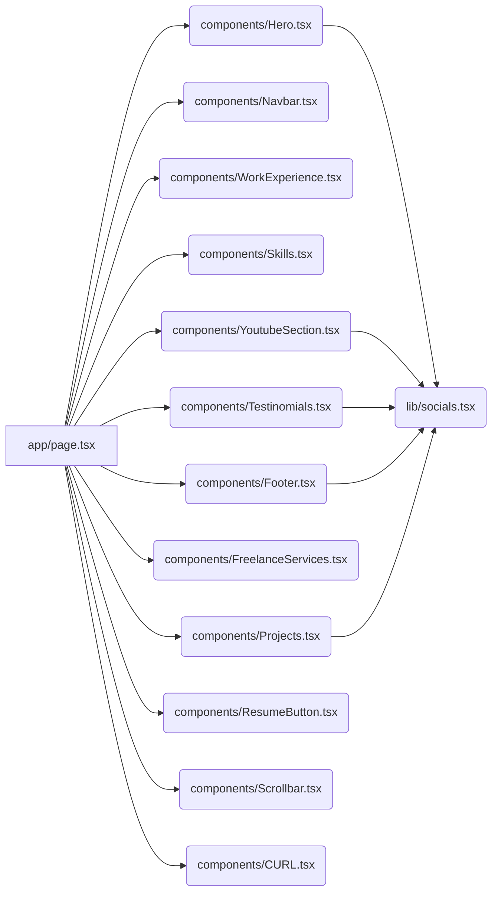
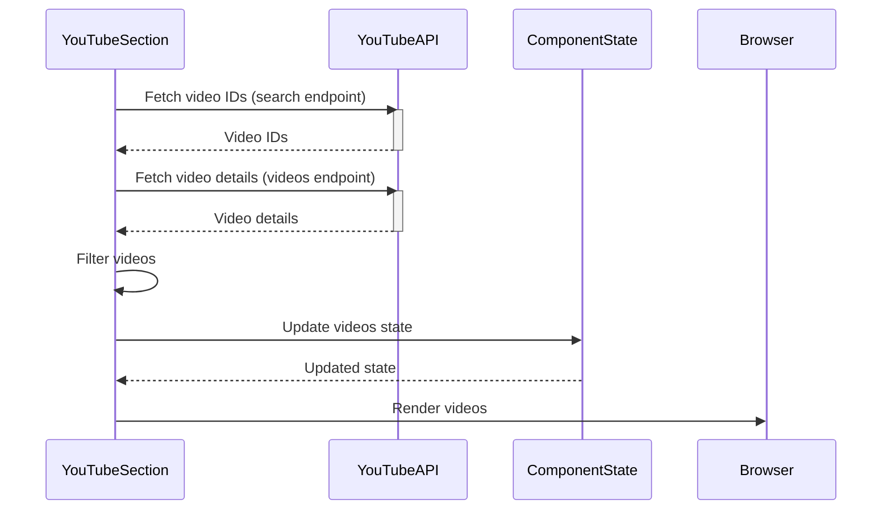
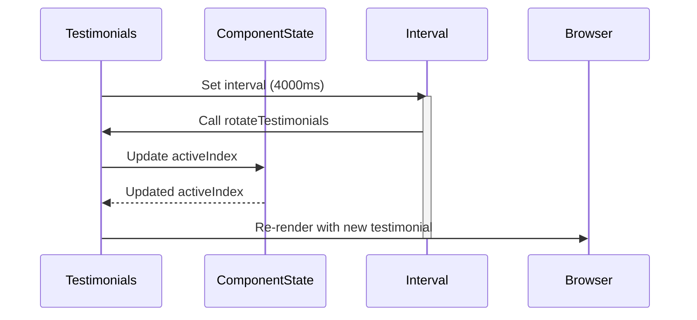
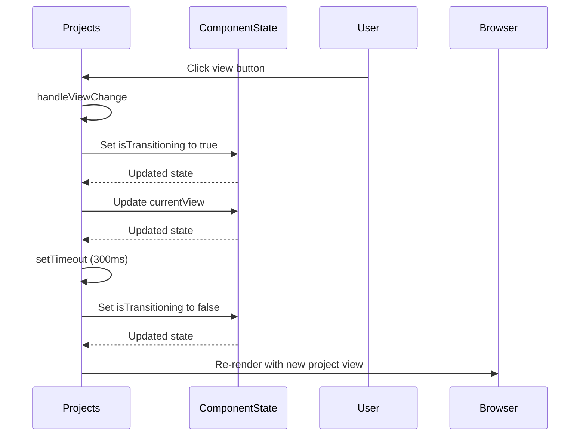

# Welcome to My Digital Den 🌿

This portfolio isn’t just a website—it's my personal corner of the internet. A place where I build, break, learn, and share. Every pixel here reflects a part of my journey—projects I've poured time into, skills I've sharpened, and the systems that keep it all running. If you're a fellow builder, feel free to peek under the hood.

If you're curious about how it all works, the technical documentation below breaks down the full architecture, workflows, and decisions behind this portfolio.

---

## Portfolio System Documentation

This document provides a comprehensive overview of the portfolio system, its architecture, workflows, and usage. It aims to equip developers with the necessary knowledge to understand, maintain, and extend the system.

### System Overview

The portfolio system is a React-based web application designed to showcase a developer's skills, experience, projects, and social media presence. It provides a visually appealing and interactive platform to present information effectively. The system is built using Next.js, leveraging its features for server-side rendering, routing, and optimization.

The key features of the system include:

*   **Hero Section:** Introduces the developer with a profile picture, name, and a brief introduction.
*   **Navigation Bar:** Provides easy access to different sections of the portfolio.
*   **Work Experience:** Showcases the developer's professional history and achievements.
*   **Skills:** Highlights the developer's technical skills and expertise.
*   **Projects:** Presents a selection of projects with descriptions, links, and technologies used.
*   **YouTube Section:** Displays recent video content from the developer's YouTube channel.
*   **Testimonials:** Features positive feedback from clients or colleagues.
*   **Freelance Services:** Promotes freelance services offered by the developer.
*   **Footer:** Contains copyright information and social media links.
*   **Interactive Terminal:** Simulates a command-line interface to display a command for copying.
*   **Smooth Scrolling Marquee:** Displays a set of slides in a marquee fashion.
*   **Floating Resume Button:** Provides a convenient way to download the developer's resume.

### Technical Architecture

The system is structured into several React components, each responsible for a specific section or functionality. These components are organized within the `components` directory. Data and configuration are stored in the `lib/socials.tsx` file. The `app` directory contains the main page (`page.tsx`), layout (`layout.tsx`), and loading state (`loading.tsx`).

**Component Relationships:**

The following diagram illustrates the relationships between the main components:



**Explanation:**

*   `app/page.tsx` is the main entry point and renders all other components.
*   `components/Hero.tsx`, `components/Navbar.tsx`, `components/WorkExperience.tsx`, `components/Skills.tsx`, `components/Projects.tsx`, `components/YoutubeSection.tsx`, `components/Testinomials.tsx`, `components/FreelanceServices.tsx`, `components/Footer.tsx`, `components/ResumeButton.tsx`, `components/Scrollbar.tsx`, and `components/CURL.tsx` are individual components responsible for rendering specific sections of the portfolio.
*   `lib/socials.tsx` provides data and configuration used by multiple components, such as social media links, project details, and testimonials.

### Main Workflows and Data Flows

#### 1. YouTube Video Fetching and Display

This workflow describes how the `YouTubeSection` component fetches and displays videos from a YouTube channel.

**Workflow:**

1.  The `YouTubeSection` component mounts.
2.  The `useEffect` hook is triggered.
3.  The `fetchVideos` function is called.
4.  The function checks for the presence of the `NEXT_PUBLIC_YOUTUBE_API_KEY` environment variable. If missing, an error message is set, and the loading state is updated.
5.  The function makes a request to the YouTube Data API v3 `search` endpoint to retrieve video IDs.
6.  The function extracts video IDs from the response.
7.  The function makes a request to the YouTube Data API v3 `videos` endpoint to retrieve video details (duration, tags, embeddable status).
8.  The function filters the videos based on embeddable status, duration (excluding videos shorter than 60 seconds), and the presence of `#shorts` tags in the title, description, or tags.
9.  The filtered videos are stored in the `videos` state variable.
10. The loading state is updated.
11. The component renders the videos in a grid.

**Data Flow Diagram:**



**Code Example:**

```typescript
const YouTubeSection = () => {
  const [videos, setVideos] = useState<YouTubeVideo[]>([]);
  const [loading, setLoading] = useState(true);
  const [error, setError] = useState<string | null>(null);

  const API_KEY = process.env.NEXT_PUBLIC_YOUTUBE_API_KEY;
  const CHANNEL_ID = 'YOUR_CHANNEL_ID'; // Replace with your actual channel ID
  const MAX_RESULTS = 20;

  useEffect(() => {
    const fetchVideos = async () => {
      if (!API_KEY) {
        setError('YouTube API key is missing.');
        setLoading(false);
        return;
      }

      try {
        const searchResponse = await axios.get(`https://www.googleapis.com/youtube/v3/search`, {
          params: {
            part: 'snippet',
            channelId: CHANNEL_ID,
            maxResults: MAX_RESULTS,
            order: 'date',
            type: 'video',
            key: API_KEY,
          },
        });

        const videoIds = searchResponse.data.items
          ?.map((item: any) => item.id.videoId)
          .filter(Boolean)
          .join(',');

        if (!videoIds) {
          setError('No videos found for this channel.');
          setLoading(false);
          return;
        }

        const videosResponse = await axios.get(`https://www.googleapis.com/youtube/v3/videos`, {
          params: {
            part: 'snippet,contentDetails,status',
            id: videoIds,
            key: API_KEY,
          },
        });

        const filteredVideos = videosResponse.data.items.filter((video: YouTubeVideo) => {
          if (!video.status?.embeddable) {
            console.warn(`Video ${video.id} is not embeddable.`);
            return false;
          }

          const duration = video.contentDetails?.duration || 'PT0S';
          const match = duration.match(/PT(?:(\d+)H)?(?:(\d+)M)?(?:(\d+)S)?/);
          const hours = parseInt(match?.[1] || '0');
          const minutes = parseInt(match?.[2] || '0');
          const seconds = parseInt(match?.[3] || '0');
          const totalSeconds = hours * 3600 + minutes * 60 + seconds;

          const isNotShort =
            totalSeconds > 60 &&
            !(
              video.snippet.tags?.includes('shorts') ||
              video.snippet.title.toLowerCase().includes('#shorts') ||
              video.snippet.description.toLowerCase().includes('#shorts')
            );

          return isNotShort;
        });

        if (filteredVideos.length === 0) {
          setError('No embeddable videos meet the duration or content criteria.');
          setLoading(false);
          return;
        }

        setVideos(filteredVideos);
        setLoading(false);
      } catch (err: any) {
        console.error('Error fetching videos:', {
          message: err.message,
          stack: err.stack,
          response: err.response?.data,
        });
        setError('Failed to fetch videos. Please try again later.');
        setLoading(false);
      }
    };

    fetchVideos();
  }, [API_KEY]);

  // ... rendering logic ...
};
```

#### 2. Testimonials Rotation

This workflow describes how the `Testimonials` component automatically rotates through a list of testimonials.

**Workflow:**

1.  The `Testimonials` component mounts.
2.  The `useState` hook initializes the `activeIndex` to 0.
3.  The `useCallback` hook memoizes the `rotateTestimonials` function.
4.  The `useEffect` hook sets up an interval that calls `rotateTestimonials` every 4000 milliseconds (4 seconds).
5.  If the `isHovering` state is true (mouse is hovering over the component), the interval is cleared.
6.  The `rotateTestimonials` function increments the `activeIndex` and updates the state, causing the component to re-render with the next testimonial.

**Data Flow Diagram:**



**Code Example:**

```typescript
import { useState, useEffect, useCallback } from 'react';
import Image from 'next/image';
import { testimonials } from '@/lib/socials';

const Testimonials = () => {
  const [activeIndex, setActiveIndex] = useState(0);
  const [isHovering, setIsHovering] = useState(false);

  // Memoize the interval callback to prevent re-creation
  const rotateTestimonials = useCallback(() => {
    setActiveIndex(prevIndex => (prevIndex + 1) % testimonials.length);
    // eslint-disable-next-line react-hooks/exhaustive-deps
  }, [testimonials.length]);

  useEffect(() => {
    if (!isHovering) {
      const interval = setInterval(rotateTestimonials, 4000);
      return () => clearInterval(interval);
    }
  }, [isHovering, rotateTestimonials]);

  // ... rendering logic ...
};
```

#### 3. Project View Switching

This workflow describes how the `Projects` component handles switching between "fullstack" and "devops" project views.

**Workflow:**

1.  The `Projects` component mounts.
2.  The `useState` hook initializes the `currentView` to 'fullstack'.
3.  The `handleViewChange` function is called when the user clicks on a view button.
4.  The function checks if the new view is the same as the current view. If so, it returns without doing anything.
5.  The function sets the `isTransitioning` state to `true`.
6.  The function updates the `currentView` state with the new view.
7.  After a short delay (300ms), the `isTransitioning` state is set back to `false`, removing the blur effect.
8.  The component re-renders, displaying the projects corresponding to the new view.

**Data Flow Diagram:**



**Code Example:**

```typescript
const Projects = () => {
  const [currentView, setCurrentView] = useState<'fullstack' | 'devops'>('fullstack');
  const [isTransitioning, setIsTransitioning] = useState(false);

  // Handle view switching with blur effect
  const handleViewChange = (view: 'fullstack' | 'devops') => {
    if (view === currentView) return;
    setIsTransitioning(true);

    setTimeout(() => {
      setIsTransitioning(false);
    }, 300);

    setCurrentView(view);
  };

  // ... rendering logic ...
};
```

### Real Code Examples

#### 1. Social Links Configuration

The `lib/socials.tsx` file defines an array of social media links. This array is used by the `Hero` and `Footer` components to display the developer's social media profiles.

```typescript
// lib/socials.tsx
import { FaGithub, FaLinkedin, FaXTwitter, FaYoutube, FaDiscord } from 'react-icons/fa6';

export const socialLinks = [
  {
    name: 'GitHub',
    url: 'https://github.com/sreecharan-desu',
    icon: FaGithub,
  },
  {
    name: 'LinkedIn',
    url: 'https://www.linkedin.com/in/sreecharan-desu/',
    icon: FaLinkedin,
  },
  {
    name: 'X',
    url: 'https://twitter.com/sr33charan',
    icon: FaXTwitter,
  },
  {
    name: 'YouTube',
    url: 'https://www.youtube.com/@sr33charan',
    icon: FaYoutube,
  },
  {
    name: 'Discord',
    url: 'https://discord.com/users/1370022259606945792',
  },
];
```

#### 2. Project Data Structure

The `lib/socials.tsx` file also defines arrays of project data, categorized as `fullstackProjects` and `devopsProjects`. Each project object contains information such as the title, description, live URL, GitHub URL, technologies used, image, and status.

```typescript
// lib/socials.tsx
export interface Project {
  title: string;
  description: string;
  liveUrl: string;
  githubUrl: string;
  tech: string[];
  image: string;
  status: 'online' | 'building';
}

export const fullstackProjects: Project[] = [
  {
    title: 'Project 1',
    description: 'A full-stack web application built with React, Node.js, and MongoDB.',
    liveUrl: 'https://project1.example.com',
    githubUrl: 'https://github.com/user/project1',
    tech: ['React', 'Node.js', 'MongoDB', 'Express'],
    image: '/images/project1.png',
    status: 'online',
  },
  // ... more projects
];

export const devopsProjects: Project[] = [
  {
    title: 'Project 2',
    description: 'A DevOps project involving infrastructure automation with Terraform and Ansible.',
    liveUrl: '',
    githubUrl: 'https://github.com/user/project2',
    tech: ['Terraform', 'Ansible', 'AWS', 'Docker'],
    image: '/images/project2.png',
    status: 'building',
  },
  // ... more projects
];
```

### How Developers Would Use This in Practice

#### Adding a New Project

1.  **Define the project data:** Create a new project object in `lib/socials.tsx` and add it to either the `fullstackProjects` or `devopsProjects` array, depending on the project type.
2.  **Provide project details:** Ensure that all required fields (title, description, liveUrl, githubUrl, tech, image, status) are populated with accurate information.
3.  **Add the project image:** Place the project image in the `public/images` directory and update the `image` field in the project object with the correct path.
4.  **Verify the display:** Check the `Projects` section of the portfolio to ensure that the new project is displayed correctly.

#### Modifying Social Media Links

1.  **Open `lib/socials.tsx`:** Locate the `socialLinks` array.
2.  **Update the links:** Modify the `url` field of the existing social media objects or add new objects for additional social media platforms.
3.  **Verify the changes:** Check the `Hero` and `Footer` sections of the portfolio to ensure that the social media links are updated correctly.

#### Customizing the YouTube Section

1.  **Set the API key:** Ensure that the `NEXT_PUBLIC_YOUTUBE_API_KEY` environment variable is set with a valid YouTube Data API v3 key.
2.  **Update the channel ID:** Modify the `CHANNEL_ID` variable in the `YouTubeSection` component with the correct YouTube channel ID.
3.  **Adjust the maximum results:** Modify the `MAX_RESULTS` variable in the `YouTubeSection` component to control the number of videos displayed.
4.  **Verify the display:** Check the `YouTube` section of the portfolio to ensure that the videos are displayed correctly.

### Important Implementation Details and Gotchas

#### Environment Variables

The `YouTubeSection` component relies on the `NEXT_PUBLIC_YOUTUBE_API_KEY` environment variable. Ensure that this variable is set correctly in the `.env.local` file or in the hosting environment.

#### Image Optimization

The `next/image` component is used for image optimization. Ensure that the `src`, `alt`, `width`, and `height` attributes are set correctly for each image. The `sizes` attribute should be adjusted based on the layout and screen size.

#### Error Handling

The `YouTubeSection` component includes error handling to gracefully handle cases where the API key is missing, no videos are found, or the API request fails. Ensure that these error messages are displayed to the user in a clear and informative way.

### Common Issues and Troubleshooting

#### YouTube Videos Not Loading

*   **Check the API key:** Verify that the `NEXT_PUBLIC_YOUTUBE_API_KEY` environment variable is set correctly.
*   **Check the channel ID:** Verify that the `CHANNEL_ID` variable in the `YouTubeSection` component is set correctly.
*   **Check the API quota:** Ensure that the YouTube Data API v3 quota has not been exceeded.
*   **Check the network connection:** Verify that the client has a stable internet connection.

#### Images Not Displaying

*   **Check the image path:** Verify that the `image` field in the project objects is set to the correct path.
*   **Check the image file:** Ensure that the image file exists in the `public/images` directory.
*   **Check the `next/image` attributes:** Verify that the `src`, `alt`, `width`, and `height` attributes of the `next/image` component are set correctly.

### Advanced Configuration and Customization Options

#### Customizing the Theme

The portfolio system uses Tailwind CSS for styling. Developers can customize the theme by modifying the `tailwind.config.js` file.

#### Adding New Sections

Developers can add new sections to the portfolio by creating new React components and adding them to the `app/page.tsx` file.

#### Integrating with a CMS

The portfolio system can be integrated with a content management system (CMS) to allow content to be managed dynamically. This would involve replacing the static data in `lib/socials.tsx` with data fetched from the CMS API.

### Performance Considerations and Optimization Strategies

#### Code Splitting

Next.js automatically performs code splitting, which helps to reduce the initial load time of the application.

#### Image Optimization

The `next/image` component is used for image optimization, which helps to reduce the size of images and improve performance.

#### Caching

The YouTube Data API v3 responses can be cached to reduce the number of API requests and improve performance.

### Security Implications and Best Practices

#### Environment Variables

Sensitive information, such as the YouTube Data API v3 key, should be stored in environment variables and not directly in the code.

#### Input Validation

User input should be validated to prevent security vulnerabilities, such as cross-site scripting (XSS) attacks.

#### Dependency Management

Dependencies should be kept up to date to address security vulnerabilities.

This documentation provides a comprehensive overview of the portfolio system. By understanding the architecture, workflows, and implementation details, developers can effectively maintain and extend the system to meet their specific needs.
